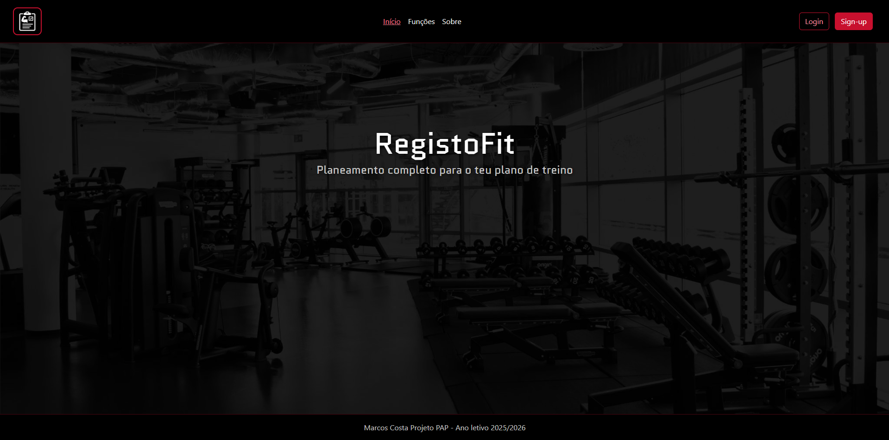
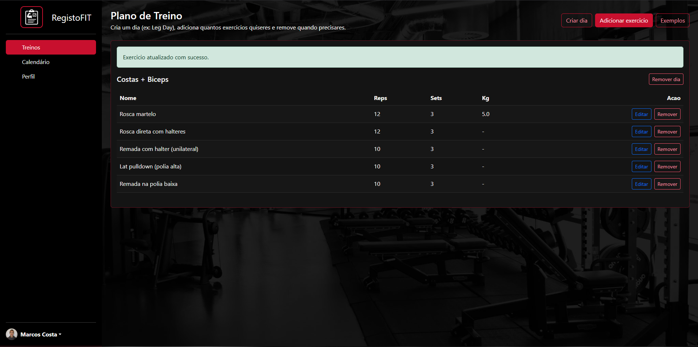
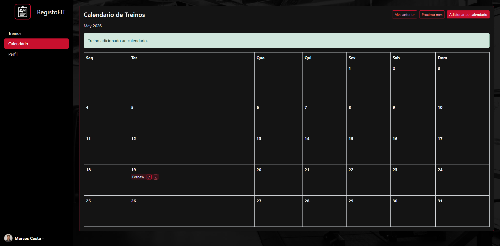
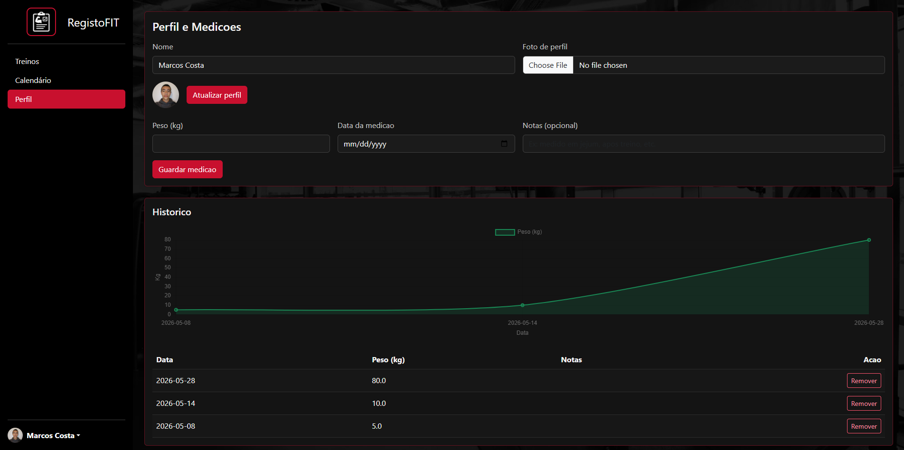

  <table border="0" cellpadding="20" cellspacing="0" style="border: 1px solid #30363d; border-radius: 8px; background-color: #161b22;">
    <tr>
      <td align="center" valign="middle">
        
         
        <b>Escola Secundária Dr. José Afonso (ESJA)</b> Seixal, Portugal
      </td>
    </tr>
  </table>

# RegistoFIT

Aplicacao web desenvolvida como projeto PAP para planeamento e acompanhamento de treinos.

### Screenshots

<table border="0" cellpadding="8" cellspacing="0">
  <tr>
    <th align="center">Pagina Principal</th>
    <th align="center">Dashboard</th>
  </tr>
  <tr>
    <td align="center"></td>
    <td align="center"></td>
  </tr>
  <tr>
    <th align="center">Calendário</th>
    <th align="center">Perfil</th>
  </tr>
  <tr>
    <td align="center"></td>
    <td align="center"></td>
  </tr>
</table>

## Sobre o projeto

O **RegistoFIT** permite criar planos de treino por dia, adicionar exercicios com series/repeticoes/carga, agendar treinos num calendario e acompanhar progresso pessoal atraves do perfil.

O foco do projeto e oferecer uma interface simples, rapida e organizada para o utilizador gerir os seus treinos num so sitio.

## Funcionalidades

- Autenticacao de utilizadores (registo, login e logout)
- Criacao e gestao de dias de treino
- Adicao e remocao de exercicios por dia
- Calendario mensal com marcacoes de treino
- Marcacao de treino como concluido
- Perfil com nome, foto e historico de medicoes (peso)
- Tema visual dark/red com fundo global e animacoes entre paginas

## Stack usada

- **Frontend:** HTML, CSS, Bootstrap 5, Bootstrap Icons
- **Backend:** PHP
- **Base de dados:** MySQL (via XAMPP)

## Requisitos

- [XAMPP](https://www.apachefriends.org/)
  - Apache
  - MySQL
- PHP 8+ (recomendado)

## Como correr localmente

1. Clonar ou descarregar este repositorio.
2. Colocar a pasta do projeto em:
   - `C:\xampp\htdocs\RegistroFIT-main`
3. Iniciar no XAMPP:
   - **Apache**
   - **MySQL**
4. Criar/importar a base de dados e configurar a ligacao no ficheiro:
   - `conexao.php`
5. Abrir no navegador:
   - `http://localhost/RegistroFIT-main/index.html`

## Estrutura principal

- `index.html` - pagina inicial publica
- `funcoes.html` - apresentacao de funcionalidades
- `sobre.html` - descricao do projeto
- `login.php` / `register.php` - autenticacao
- `main.php` - gestao de plano de treino
- `calendar.php` - calendario de treinos
- `perfil.php` - perfil, foto e medicoes
- `style.css` - estilos globais
- `page-transitions.js` - animacoes entre paginas

## Melhorias futuras

- Edicao de exercicios ja registados
- Filtros e pesquisa no historico
- Dashboard com graficos de progresso
- Internacionalizacao (PT/EN)

## Autor

**Marcos Costa**  
Projeto PAP - Ano letivo 2025/2026
